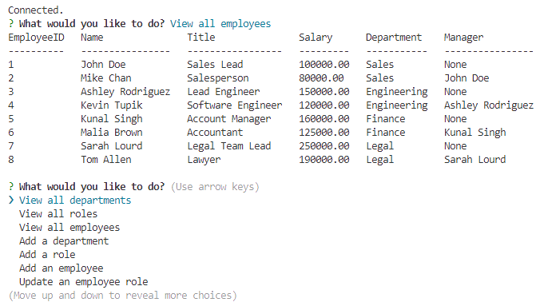

# Employee CMS

[](https://opensource.org/licenses/MIT)

## Description

A commandline CMS for employee management.

## Table of Contents

* [Installation](#installation)
* [Usage](#usage)
* [License](#license)
* [Contributing](#contributing)
* [Tests](#tests)
* [Questions](#questions)

## Installation

Clone the repository and run ```npm install``` in the root directory.

## Usage

Run ```npm start``` in the root directory.

Preview image:



[Link to Demonstration video](https://drive.google.com/file/d/19L6nFaoTeTAFGh_mXYjpCoDJGyLTRv_B/view?usp=sharing)

## License

This project uses the [MIT](https://opensource.org/licenses/MIT) license.

## Contributing

No contributions accepted.

## Tests

Run ```npm test``` in the root directory.

## Questions

If you have any questions, please contact me at [github@alexbi.shop](mailto:github@alexbi.shop).

You can also find me on [Github](https://github.com/alexbishopbootcamp).

